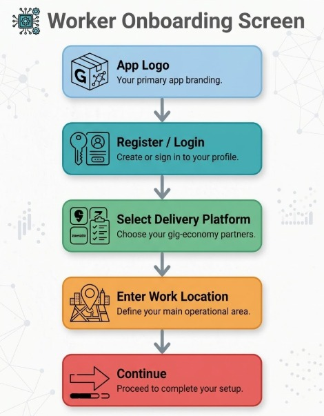
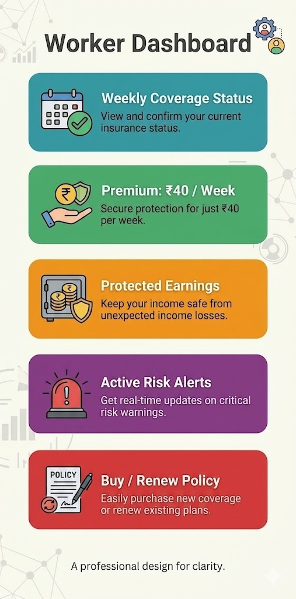
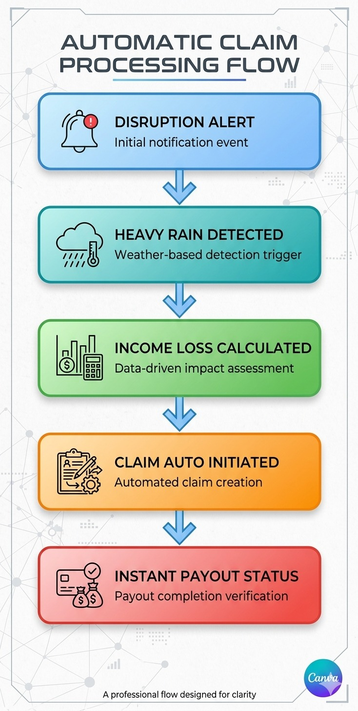
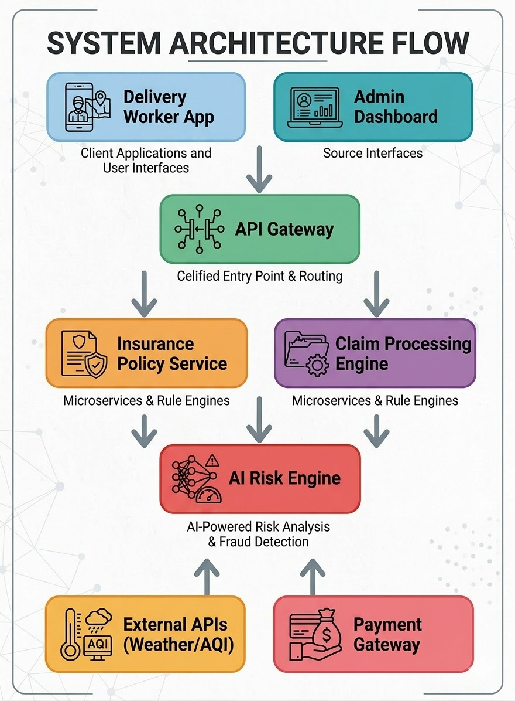
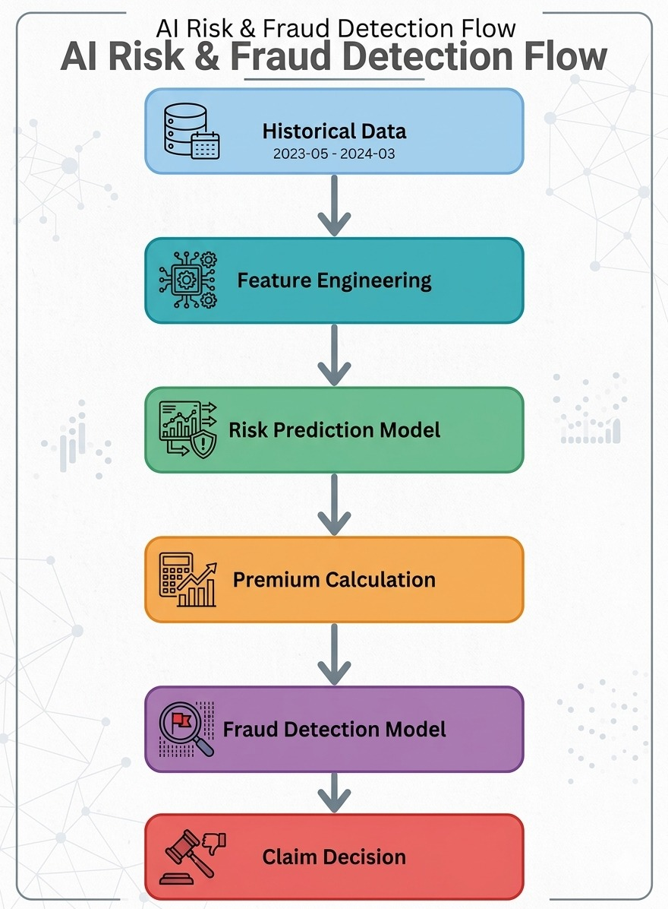
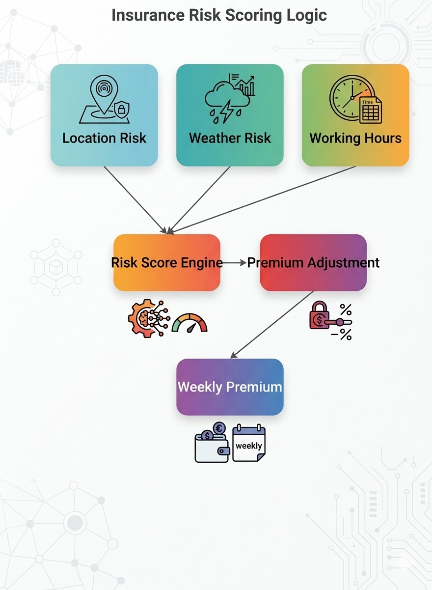

# Devtrails-project
Insurance platform for delivery workers

# GigShield

### AI-Powered Parametric Insurance Platform for Gig Delivery Workers

GigShield is an **AI-enabled parametric insurance platform** designed to protect gig delivery workers from **income loss caused by uncontrollable external disruptions** such as extreme weather conditions, severe pollution levels, or unexpected regional restrictions.

India's rapidly growing gig economy relies heavily on delivery partners who work for platforms like Zomato, Swiggy, Amazon, Zepto, Dunzo and others. These workers depend entirely on daily deliveries for their earnings. However, their income is highly vulnerable to environmental and social disruptions that prevent them from working.

GigShield introduces a **smart, automated insurance model** that continuously monitors disruption signals, calculates potential income loss, and instantly triggers payouts when predefined parametric conditions are met.

By combining **AI-driven risk assessment, automated claim processing, and a simple weekly pricing model**, GigShield creates a financial safety net tailored specifically for gig workers.

---

# 1.Problem Statement

India’s gig economy includes millions of delivery workers who play a critical role in powering modern e-commerce and food delivery services.

Despite their importance, gig workers face significant challenges:

• Their income is completely dependent on daily work availability
• External disruptions can suddenly halt delivery operations
• Workers have **no reliable financial protection** against income loss

Common disruptions include:

* Heavy rainfall
* Extreme heat waves
* Flooding
* Severe air pollution
* Government curfews or strikes
* City zone closures

When such events occur, delivery partners may lose **20–30% of their monthly earnings** due to reduced working hours or suspended deliveries.

Traditional insurance products focus on **health, life, or vehicle damage**, but they **do not protect income loss caused by environmental disruptions**.

GigShield addresses this gap by introducing a **parametric income protection system** specifically designed for gig workers.

---------

# 2.Target Persona

### Persona 1 – Rahul (Food Delivery Partner)

Age: 25
Platform: Swiggy
Location: Bangalore
Work Pattern: 9–10 hours daily

Background

Rahul works as a full-time food delivery partner in Bangalore. His income depends entirely on completing a high number of deliveries each day.

Key Challenges

Heavy rain frequently disrupts evening delivery hours.

Extreme heat makes it unsafe to work during afternoon hours.

Order volume drops significantly during severe weather.

Needs

Rahul needs income protection during weather disruptions so that temporary delivery shutdowns do not affect his weekly earnings.

How GigShield Helps

GigShield automatically compensates Rahul when heavy rainfall or extreme heat crosses predefined thresholds, ensuring that his lost delivery hours are financially covered.

### Persona 2 – Priya (Grocery Delivery Partner)

Age: 29
Platform: Zepto
Location: Mumbai
Work Pattern: 8 hours per day

Background

Priya delivers groceries within densely populated city zones. Her income is based on the number of quick deliveries completed within limited time windows.

Key Challenges

Flooded roads during monsoon season prevent deliveries.

Traffic congestion increases delivery delays.

Local zone shutdowns occasionally stop deliveries entirely.

Needs

Priya requires fast compensation when city disruptions stop deliveries so that she does not lose daily income.

How GigShield Helps

GigShield detects flooding and zone closures using weather and traffic data and automatically triggers income protection payouts.

### Persona 3 – Arjun (E-Commerce Delivery Associate)

Age: 31
Platform: Amazon Logistics
Location: Delhi
Work Pattern: Package deliveries across multiple zones

Background

Arjun delivers packages for an e-commerce logistics platform. His delivery routes cover large urban and suburban areas.

Key Challenges

Severe pollution alerts limit outdoor working hours.

Government curfews sometimes restrict movement.

Long delivery routes increase exposure to environmental risks.

Needs

Arjun needs protection against income loss during city-wide disruptions that prevent him from completing scheduled deliveries.

How GigShield Helps

GigShield monitors pollution levels and city restrictions. When pollution exceeds safety thresholds or curfews are announced, the system triggers automatic compensation.

-------

# 3.Solution Overview

GigShield provides a **fully automated parametric insurance platform** that protects delivery workers against income loss caused by external disruptions.

The platform combines **AI risk modeling, real-time disruption monitoring, and automated claim processing**.

### Key Capabilities

• Weekly income protection plans
• AI-based risk prediction models
• Real-time disruption monitoring
• Automatic claim triggering
• Intelligent fraud detection mechanisms
• Instant digital payouts

Instead of requiring workers to manually submit claims, GigShield uses **parametric triggers** that automatically activate compensation when predefined environmental conditions occur.

This approach removes complexity and ensures **fast, transparent, and reliable protection** for gig workers.

---

# 4.Application Workflow

The GigShield platform follows a simple and automated workflow:

1. Delivery worker registers on the platform
2. Worker selects delivery category (Food / Grocery / E-commerce)
3. System collects worker details such as location and work schedule
4. AI risk engine calculates a personalized weekly premium
5. Worker activates a weekly insurance policy
6. The platform continuously monitors disruption signals
7. When disruption thresholds are crossed, a parametric trigger activates
8. Worker activity and location are verified
9. Lost income is automatically calculated
10. Instant payout is transferred to the worker

This automated process ensures **minimal friction and rapid financial protection**.

-----

# 5.Weekly Premium Model

Gig workers typically operate on **short income cycles**, receiving payouts weekly from their delivery platforms. To align with this structure, GigShield introduces a **Weekly Subscription Insurance Model**.

Premiums are calculated dynamically using AI-based risk analysis.

### Premium Calculation Factors

• Location risk score
• Weather disruption probability
• Historical disruption frequency
• Average delivery working hours
• Delivery platform category

### Example Pricing

Base Weekly Premium: ₹30
High Rainfall Risk Zone Adjustment: +₹10

Final Weekly Premium: **₹40**

This flexible pricing model ensures that **workers only pay for the level of protection they actually need**.

------------------------

# 6.Parametric Triggers

Parametric insurance relies on **objective data signals** to trigger payouts automatically.

GigShield continuously monitors external data sources and activates insurance payouts when predefined thresholds are exceeded.

### Example Disruption Triggers

| Trigger           | Condition           |
| ----------------- | ------------------- |
| Heavy Rainfall    | Rainfall > 50mm     |
| Extreme Heat      | Temperature > 45°C  |
| Severe Pollution  | AQI > 400           |
| Government Curfew | Restricted movement |

Once a trigger condition is verified, the platform **automatically initiates a claim and processes compensation** without requiring manual user action.

-------

# 7.AI / ML Integration

Artificial Intelligence is a core component of the GigShield platform.

### Risk Prediction

Machine learning models analyze historical weather data, disruption patterns, and geographic factors to estimate **risk exposure for different delivery zones**.

This allows the system to anticipate disruptions and calculate accurate premium pricing.

### Dynamic Premium Pricing

AI models continuously adjust weekly premium values based on **real-time environmental risk conditions**.

Workers operating in safer zones benefit from **lower premiums**, while high-risk zones receive appropriately adjusted pricing.

### Fraud Detection

AI-powered fraud detection ensures platform integrity by identifying suspicious behavior such as:

• GPS spoofing attempts
• Duplicate claim submissions
• Unusual activity patterns
• Location inconsistencies

These models help maintain a **fair and trustworthy insurance ecosystem**.

---

# 8.External Integrations

GigShield integrates with several external data providers to enable real-time disruption detection.

Key integrations include:

Weather APIs – rainfall, storms, temperature alerts
Pollution APIs – AQI monitoring and environmental risk
Traffic APIs – disruption signals and zone closures
Payment Gateways – instant digital payout processing

During development, **mock APIs and sandbox services** will be used to simulate real-world data sources.

---

# 9.Technology Stack

### Frontend

React.js / Flutter

### Backend

Node.js / FastAPI

### Database

MongoDB / MYSQL

### AI / ML

Python
Scikit-learn
TensorFlow

### Cloud Infrastructure

AWS / Firebase

### Payment Processing

Razorpay Sandbox API

---

# UI Wireframes

## Worker Onboarding

The onboarding interface enables delivery workers to quickly create an account, select their delivery platform category, and activate weekly income protection within minutes.

---

## Worker Dashboard

The dashboard provides workers with a clear overview of their insurance status including:

• Active coverage period
• Weekly premium details
• Environmental risk alerts
• Protected earnings summary

---

## Automatic Claim Trigger

When disruption conditions are detected, the system automatically:

• Identifies the disruption event
• Calculates estimated income loss
• Initiates claim verification
• Processes instant payout

This ensures **fast and seamless compensation** for affected workers.

---

# System Architecture

The platform architecture is designed using modular microservices that support scalability and automation.

Core components include:

• Worker Application Interface
• API Gateway
• Policy Management Service
• AI Risk Assessment Engine
• Claim Processing Engine
• External Data Integrations
• Payment Processing System

This architecture enables **real-time monitoring and automated insurance operations**.

---

# AI Risk Prediction Flow

The AI pipeline processes environmental and operational data to determine risk levels and detect potential fraud.

The workflow includes:

1. Data collection from historical disruption datasets
2. Feature engineering for environmental risk indicators
3. Machine learning risk prediction models
4. Dynamic premium calculation
5. Fraud detection analysis
6. Automated claim approval logic

---

# Insurance Risk Scoring Model

GigShield calculates weekly premiums using a multi-factor risk scoring system.

Key risk parameters include:

• Geographic environmental risk
• Historical disruption frequency
• Worker delivery activity patterns
• Average working hours

These factors are processed through a **risk scoring engine** that determines personalized premium adjustments.

----------------------------------

# Development Plan

### Phase 1 – Ideation & Architecture

Define worker persona, research disruption scenarios, design system architecture and AI strategy.

### Phase 2 – Core Platform Development

Build core platform features including:

• Worker registration and onboarding
• Insurance policy management
• AI premium calculation engine
• Automated disruption triggers

### Phase 3 – Optimization & Scaling

• Advanced fraud detection models
• Instant payout simulation
• Worker and admin analytics dashboards

-------------------------------

# Expected Impact

GigShield aims to create a **reliable financial safety net for gig workers** by protecting their income from unpredictable environmental disruptions.

The platform introduces a **scalable AI-driven parametric insurance model** that can support millions of workers across India’s gig economy.

By combining **automation, artificial intelligence, and simplified insurance design**, GigShield empowers delivery partners with greater financial stability and resilience.

